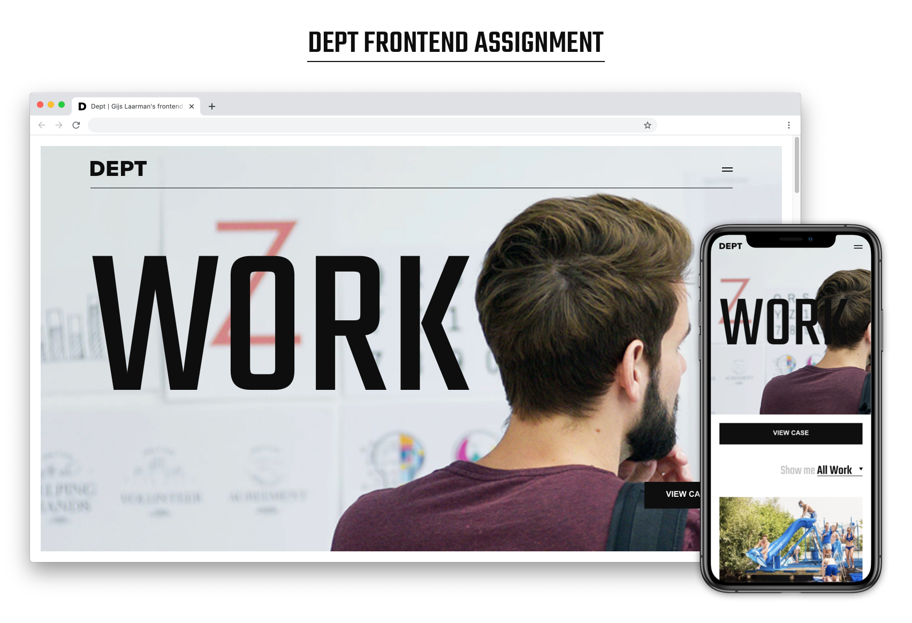

# Dept frontend assignment by Gijs Laarman



<p style="text-align: center"><a href="dept-frontend-assignment-chi.vercel.app/">Click here for the working demo</a></p>

## Build With

- [Vue](https://v3.vuejs.org/guide/introduction.html), used for a component based setup. And the ability to manage states (scroll position, is item in view) easily.
- [Nuxt](https://nuxtjs.org/), for SSR. Overkill for what it is right now, but makes the page a Single Page Application (without having to use a hash router) and can add transitions between pages (notice how the menu fades away when you click a link inside of it).
- [SCSS]('https://sass-lang.com/guide') for creating variables inside CSS & breakpoints mixins.

## Installation & Build Setup

Installation:

```bash
# clone repository
$ git clone https://github.com/gijslaarman/dept-frontend-assignment.git && cd dept-frontend-assignment

# install dependencies
$ npm install
```

Usage:

```bash
# serve with hot reload at localhost:3000
$ npm run dev

# build for production and launch server
$ npm run build
# &
$ npm run start

# generate static project
$ npm run generate
```

For detailed explanation on how things work, check out [Nuxt.js docs](https://nuxtjs.org).

## Thoughts

Forgive my messy code, 2 days is a very short time span but I think I did quite well on the end result. I would have loved to be more systematic but there wasn't a lot of time for refactoring.

Some minor bugs are still present. Nuxt is forcing me to use scoped css, and I'm not a huge fan of that so I'm confusing Nuxt in that sense. (Try to use the element inspector and see how the css gets super confused when you toggle a css-property on or off). I know what the issue is (scoped styling) but had no time to fix this anymore.

Overall I thought it was quite a challenging assignment, not too easy (weird sized fonts & odd layout components), but also not too hard. With more time I would probably have approached this with a more systematic approach, but also have a lot to learn, best practices wise.
